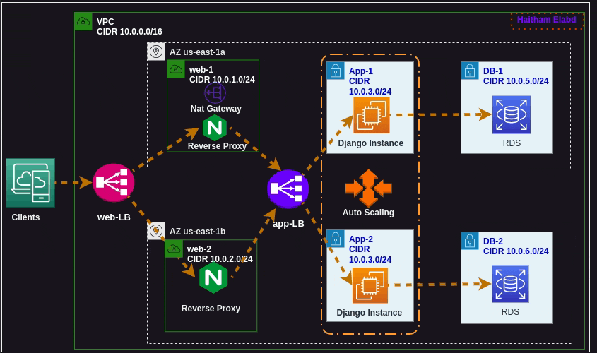

## Terraform AWS Infrastructure for Django Applications



This project is designed to create AWS infrastructure to support a  three-tier web application, specifically tailored for Django, utilizing  Terraform. It is organized using modular components to enhance  manageability and scalability. The following modules have been created

### Modules 

#### VPC 

In this module I create Virtual Private Cloud (VPC), an Internet Gateway (IGW), an Elastic IP  (EIP), and a NAT Gateway. These components establish the necessary  networking infrastructure for the AWS environment, enabling connectivity and access control.

#### Subnet 

The Subnets module defines the creation of various subnets within the VPC. I separate subnets for different tiers of the application - WEB, APP, and  DB. It also associates appropriate route tables for each subnet to  ensure proper routing within the VPC.

#### Web 

The Web tier module defines the creation of resources related to the web servers. This code sets up a security group for the web servers, launches Nginx  instances, creates a load balancer for the web tier, and configures a  target group and listener for the load balancer.

#### App 

The App module is responsible for setting up resources related to the Django application. This code sets up the security group, launch configuration for the  Django application, auto-scaling group, load balancer, target group, and listener for the application tier.

#### Database 

In the Database tier, we will have another layer of private subnets  hosting a MySQL database which will  eventually be accessed using  Django. 

### Deployment Instructions

1. Clone The Repository
    ````bash 
   git clone https://github.com/h3itham/terraform-aws-django-3tier.git
   ````

3. Initialize Terrafrom. 
   **Note** before run this command you should create or add your backend state file or simply delete my state file `remote_backend.tf` 

   ````bash 
   rm remote_backend.tf
   terrafrom init 
   ````

4. Customize your variables in `terrafrom.tfvars` file,  according to your specific needs

5. Review Terraform plan 

   ````bash 
   terrafrom plan
   ````

6. Apply terrafrom changes 

   `````bash 
   terrafrom apply
   `````

7. Finally Don't forget to destroy your infra. 

   `````bash 
   terrafrom destroy 
   `````

   
